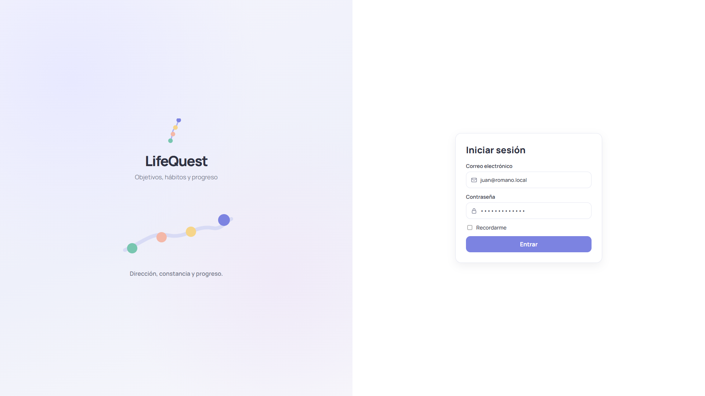
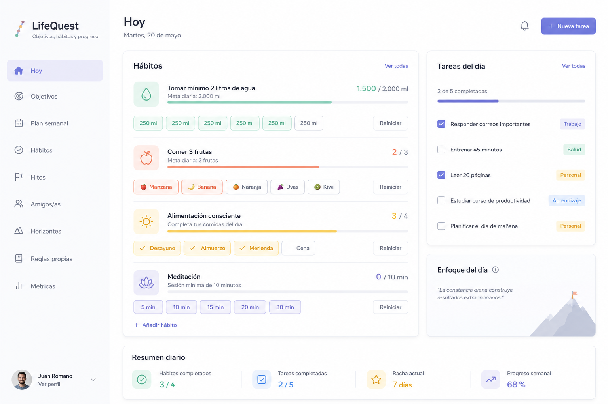
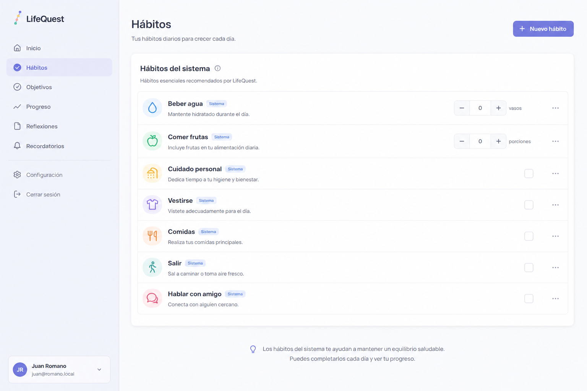
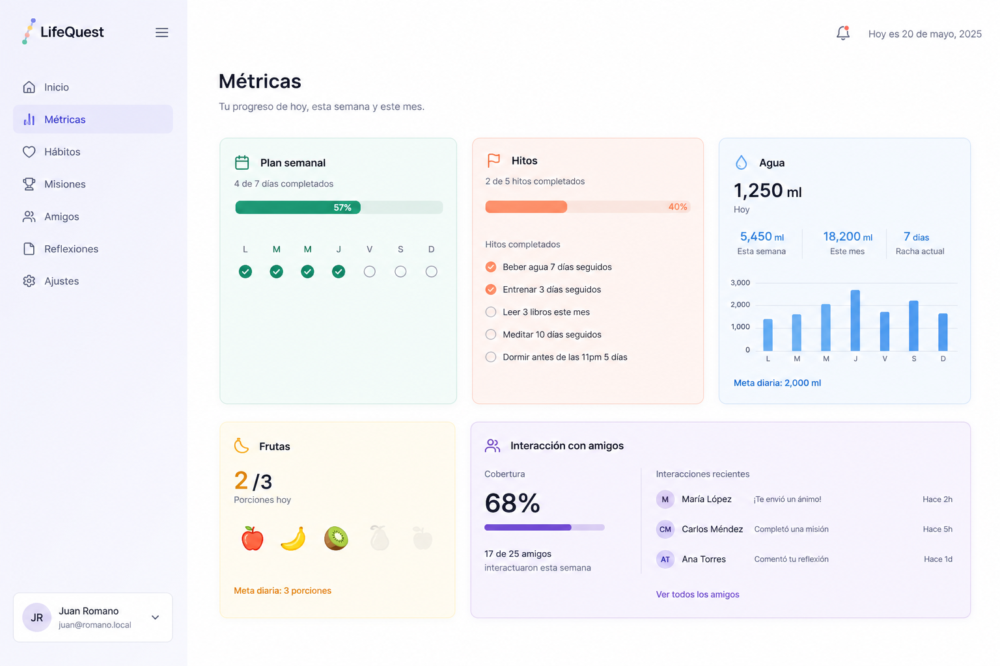

# LifeQuest

**Dirección, constancia y progreso.**

LifeQuest es una app personal para planear el año, sostener hábitos diarios y ver el avance en un solo lugar. Está pensada para uso individual (Home Lab / servidor propio): PHP + MySQL, sin frameworks de frontend ni dependencias de Composer.

<p align="center">
  
</p>

---

## Objetivo del proyecto

LifeQuest responde a una pregunta simple: *¿estoy haciendo hoy lo que dije que iba a hacer este año?*

- **Objetivos anuales** por área (meses, unidades o sí/no), más **horizontes** de largo plazo.
- **Hábitos diarios** (incluyendo hábitos de sistema fijos: agua, frutas, rutinas, hablar con amigos/as).
- **Plan semanal** y pantalla **Hoy** para ejecutar el día.
- **Hitos**, **amigos/as** (rotación de charlas) y **métricas** para cerrar el círculo.

No es una red social ni un SaaS multi-tenant: es un planificador serio para una sola persona, desplegable copiando una carpeta.

<p align="center">
  
</p>

---

## Pantallas

| Pantalla | Para qué |
|----------|----------|
| **Hoy** | Hábitos del día, agua/frutas, tareas, hitos pendientes |
| **Objetivos** | Plan anual por área |
| **Plan semanal** | Tareas por día de la semana |
| **Hábitos** | Lista completa (sistema + propios) |
| **Hitos** | Fechas importantes; pueden bloquear Hoy si vencen |
| **Amigos/as** | Lista cercana + sugerencia diaria de con quién hablar |
| **Horizontes** | Objetivos de largo plazo (sí/no) |
| **Reglas propias** | Principios / reglas personales |
| **Métricas** | Agua, frutas, plan semanal, hitos, interacción con amigos/as |
| **Revisiones / Archivo / Configuración** | Cierre, histórico y preferencias |

<p align="center">
  
</p>

---

## Hábitos de sistema (siempre en cualquier deploy)

En cada instalación / login / migrate, LifeQuest asegura estos hábitos con `is_system = 1`:

| Clave | Nombre | Medición |
|-------|--------|----------|
| `sys_water` | Tomar mínimo 2 litros de agua | Cantidad diaria (vasos/botellas → 2000 ml) |
| `sys_fruit` | Comer 3 frutas | Cantidad diaria (banana / mandarina / naranja → 3) |
| `sys_care` | Cuidado personal | Check diario |
| `sys_dress` | Vestirse | Check diario |
| `sys_breakfast` / `sys_lunch` / `sys_snack` / `sys_dinner` | Comidas | Check diario |
| `sys_go_out` | Salir de casa | Check diario |
| `sys_talk_friend` | Hablar con algún amigo/a | Check diario + rotación fija del día |

**No se pueden editar, archivar ni eliminar** desde la UI. Son diarios (lunes a lunes). El catálogo vive en código (`HabitService::systemCatalog`) y está documentado en `sql/schema.sql`.

---

## Esquema SQL (un solo archivo)

Todo el DDL está en:

```
sql/schema.sql
```

No hay otros `.sql` de migraciones ni dumps versionados.  
- **Instalación nueva:** `install.php` aplica `sql/schema.sql` y siembra datos de ejemplo + hábitos de sistema.  
- **Instalación existente:** `migrate.php` hace ALTERs idempotentes en PHP y vuelve a asegurar hábitos de sistema / tablas nuevas.

---

## Requisitos

- PHP **8.1+** (`pdo_mysql`, `mbstring`, `json`, `session`)
- MySQL **8+** (o MariaDB compatible)
- Apache / nginx / IIS sirviendo la carpeta
- Sin Composer ni Node para correr la app

---

## Instalación (deploy nuevo)

### 1. Copiar el proyecto

Copiá el repo al document root (ej. `W:\lifequest` → `http://servidor/lifequest`).

### 2. Configurar `.env`

```bash
cp .env.example .env
```

```env
APP_URL=http://TU-SERVIDOR/lifequest
DB_HOST=127.0.0.1
DB_PORT=3306
DB_NAME=lifequest
DB_USER=root
DB_PASS=tu_password_mysql
SESSION_LIFETIME=86400
SESSION_IDLE=86400
```

`APP_URL` sin barra final. En producción: `APP_DEBUG=false`.

### 3. Instalar

Abrí:

`http://TU-SERVIDOR/lifequest/install.php` → **Instalar ahora**

Eso crea la base, aplica **`sql/schema.sql`**, siembra el demo y crea los hábitos de sistema.

Usuario demo:

- Email: `demo@lifequest.local`
- Contraseña: `lifequest-demo`

Cambiá la contraseña en **Configuración** antes de usarlo en serio. Después podés borrar o renombrar `install.php`.

### 4. Actualizar una instalación existente

1. Copiá el código nuevo **sin pisar** el `.env` del servidor.  
2. Abrí `http://TU-SERVIDOR/lifequest/migrate.php`.  
3. Hard refresh (Ctrl+F5) si CSS/JS no se ven actualizados (`?v=` en assets).

```bat
robocopy C:\ruta\LifeQuest W:\lifequest /E /XD .git /XF .env
```

---

## Guía de uso

### Hoy

1. Entrá a **Hoy**: ahí están los hábitos del día y las tareas.  
2. **Agua:** sumá / restá 250 o 500 ml hasta 2000.  
3. **Frutas:** sumá banana, mandarina o naranja hasta 3; −1 para corregir.  
4. **Hablar con amigo/a:** la app sugiere una persona; al tildar queda **fija todo el día**.  
5. Completá tareas del plan semanal desde Hoy o desde Plan semanal.

### Objetivos

1. Elegí el año.  
2. **+ Nuevo objetivo** por área.  
3. Medición: **meses** (12 tildes), **unidades** (meta numérica) o **sí/no**.  
4. Edición siempre en modal.

### Horizontes

Objetivos de largo plazo, separados del plan anual, con áreas propias. Solo logrado / en camino.

### Hábitos propios

Además de los de sistema podés crear hábitos por meses, unidades o diario. Los de sistema muestran badge **Sistema** y no abren edición.

### Plan semanal

Tareas por día, con horario y estimación. Podés copiar una tarea a otros días de la misma semana.

### Hitos

Cargá fechas importantes. Si un hito vence o es hoy y no está hecho, puede bloquear **Hoy** hasta marcarlo.

### Amigos/as

1. Agregá nombres cercanos.  
2. El hábito de hablar rota sin repetir.  
3. Contadores: cuántos hay, charlas de la semana/mes, sin hablar aún.

### Métricas

<p align="center">
  
</p>

Vista consolidada del año: completitud de áreas, plan semanal, hitos, **agua**, **frutas** e **interacción con amigos/as**.

### Tema

Claro / oscuro desde la barra o Configuración.

---

## URLs

Sin `mod_rewrite`; las rutas van por query string:

```
http://TU-SERVIDOR/lifequest/index.php?r=/today
http://TU-SERVIDOR/lifequest/index.php?r=/login
```

Atajos: `?r=/goals`, `/habits`, `/weekly`, `/milestones`, `/friends`, `/horizon`, `/metrics`, `/settings`.

---

## Seguridad del repositorio

| Archivo | Esperado |
|---------|----------|
| `.env` | **No** en el repo (`.gitignore`) |
| `.env.example` | Plantilla sin secretos |
| `sql/schema.sql` | Solo DDL; **único** SQL versionado |
| Semilla demo | Solo para instalación de ejemplo |

No commitear dumps con datos reales ni scripts de diagnóstico.

---

## Estructura

```
LifeQuest/
├── app/                 # Controllers, Services, Views, Auth, Router
├── assets/              # CSS y JS
├── config/              # app.php, database.php, env.php
├── docs/screenshots/    # Capturas para esta guía
├── sql/schema.sql       # Único esquema SQL
├── index.php
├── install.php
├── migrate.php
├── .env.example
└── README.md
```

---

## Notas

- Una cuenta por instalación (uso personal).  
- Zona horaria por defecto: `America/Argentina/Buenos_Aires`.  
- Sesión: cookie renovable 24 h (`SESSION_LIFETIME` / `SESSION_IDLE`).  
- El semillero demo inventa datos del año en curso; no son datos reales del dueño del repo.
